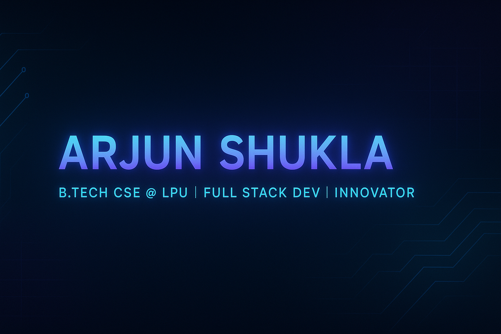

<!-- ✨ Header Animation -->
<p align="center">
  
</p>

<!-- 🌌 Hero Banner -->
<p align="center">
  
</p>

---

<h2 align="center">✨ Welcome to my world of code & creativity ✨</h2>

<div align="center">
  
</div>

---

### 📘 About Me  
```yaml
Name: Arjun Shukla
Status: 💻 B.Tech CSE Student @ LPU (2025–29)
Code_style: Clean ⚡ Minimalist ⚡ Functional
Goal: To become a world-class software developer 🌍
Currently_learning: ["Full Stack Web Dev", "DSA", "Machine Learning"]
Hobbies: ["Gaming 🎮", "Design 🎨", "Storytelling ✍️", "Tech Videos 💡"]
Fun_fact: "I use dark mode in real life 😎"
```

---

### 🛠️ Tech Stack I Love

<div align="center">
  
</div>

---

### 🧪 Tools I Use Often

<p align="center">
  
  
  
  
</p>

---

### 🚀 My GitHub Stats

<p align="center">
  
  
</p>

---

### 🏆 GitHub Trophies

<p align="center">
  
</p>

---

### 📈 GitHub Contribution Streak

<p align="center">
  
</p>

---

### 🐍 Snake Eating My Contributions (GitHub Actions)

<p align="center">
  
</p>

---

### 🌐 Connect With Me

<p align="center">
  <a href="https://github.com/ArjunShuklaCSE">
    
  </a>
  <a href="https://linkedin.com/in/ArjunShuklaOfficial">
    
  </a>
  <a href="mailto:arjunshuklacse@gmail.com">
    
  </a>
</p>

---

### 🎯 Currently Working On

- 🔭 Building projects using MERN Stack  
- 🧠 Mastering Data Structures and Algorithms  
- 💼 Preparing for internships & freelance gigs  
- 🌟 Side Quest: Making my GitHub look better than my résumé 😉

---

<p align="center">
  
</p>

---

<div align="center">
  
  <br><br>
  <b>“Let's turn caffeine ☕ into code 💻”</b>
</div>
