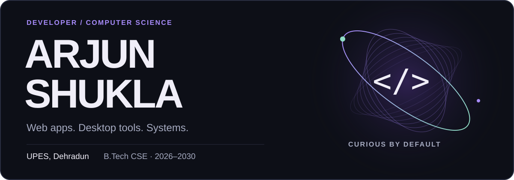
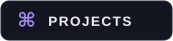
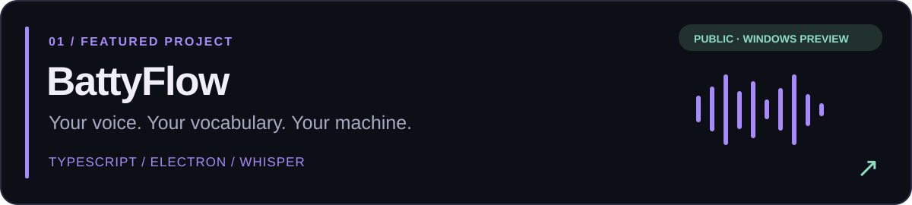
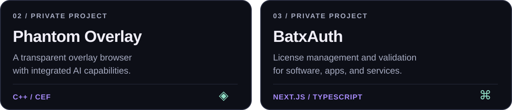
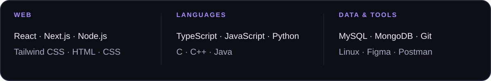
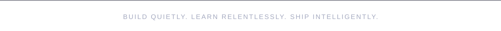

  <picture><source media="(max-width: 650px)" srcset="./assets/profile/hero-mobile.svg" /></picture>

  
  
  

 

### A little about me

I'm a computer science student at **UPES**, building web applications and desktop tools. I like understanding how things work beneath the interface—from application logic to the systems that run it.

Currently working with the **MERN stack**, practicing **data structures & algorithms**, and exploring **AI/ML and cybersecurity**.

 

### Selected work

<a href="https://github.com/ArjunShuklaCSE/BattyFlow">
  <picture><source media="(max-width: 650px)" srcset="./assets/profile/battyflow-mobile.svg" /></picture>
</a>

[Explore the source ↗](https://github.com/ArjunShuklaCSE/BattyFlow) &nbsp; · &nbsp; [Download the Windows preview ↗](https://github.com/ArjunShuklaCSE/BattyFlow/releases/tag/v0.1.0-preview)

  <picture><source media="(max-width: 650px)" srcset="./assets/profile/projects-mobile.svg" /></picture>

 

### My toolkit

<picture><source media="(max-width: 650px)" srcset="./assets/profile/stack-mobile.svg" /></picture>

 

### What's next

More desktop experiments, better full-stack applications, and stronger fundamentals. I'm preparing for **internships and freelance work** as I keep building.

Have a project in mind? [Let's talk ↗](mailto:arjunshuklacse@gmail.com)

 

